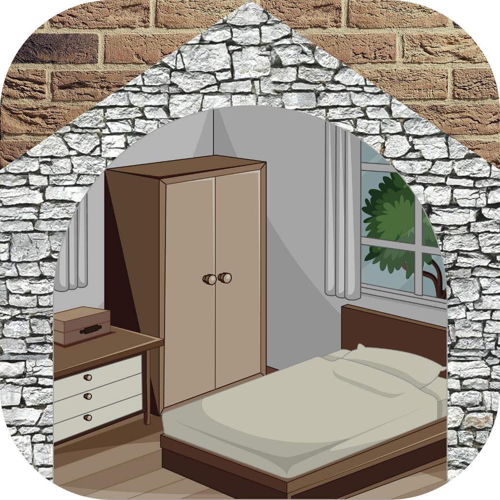
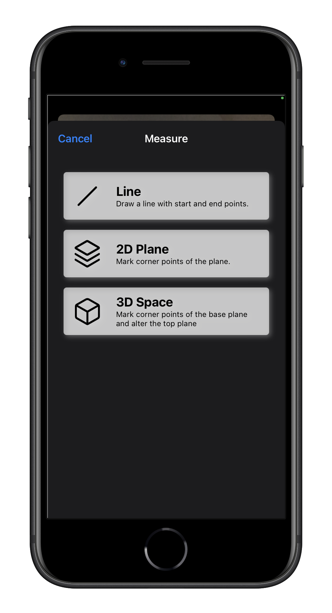
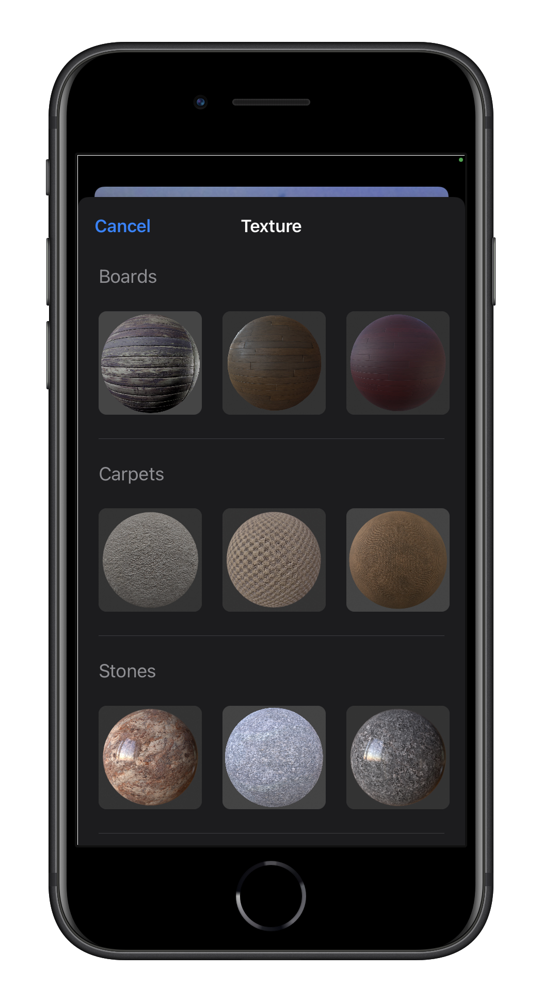
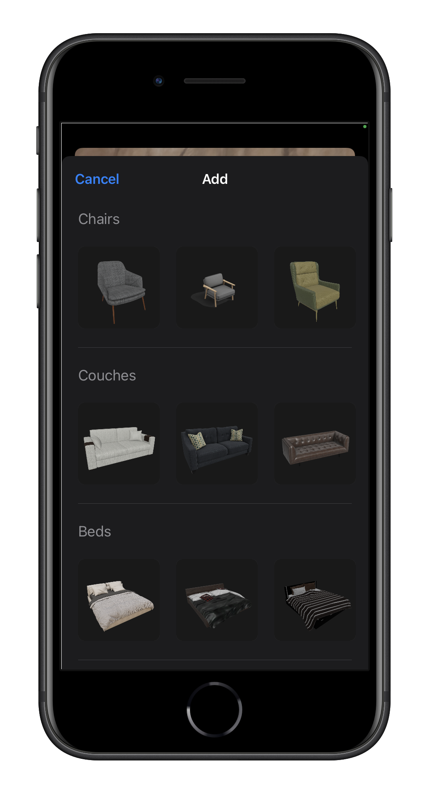
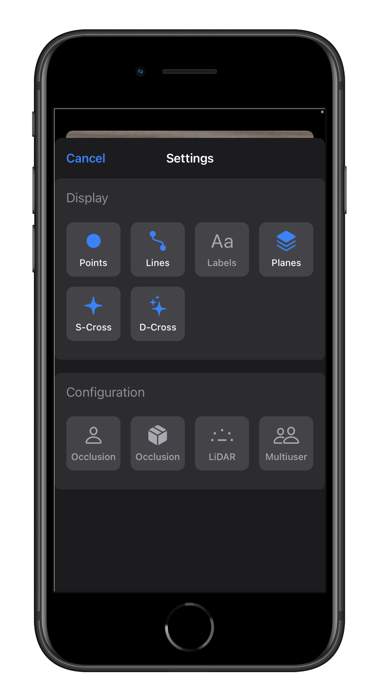
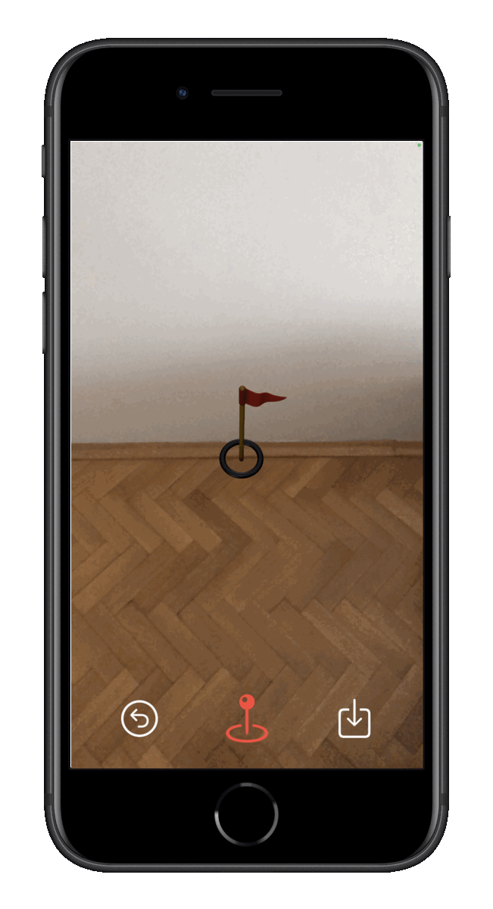

[![Swift Version][swift-image]][swift-url]

# Chamber Interior Design
 

  
  

    Chamber Interior Design iOS Augmented Reality Application designed for NTUT MSc Thesis. 
  

  

    Application is developed for interior design purpose for decision guide in real time.
  

  

    3D Room Modelling | Texture Import & Alignment | Object Import & Manipulation
  

  

    Realitykit 2 | ARKit 5 | SwiftUI
  

  

    
    
    
  

  

    
    
    
  

  

    
  

## Requirements

- Swift 5.2
- iOS 15.0 (RealityKit 2)
- Xcode 13.0 

## Features

- [x] Line Measurement
- [x] 2D Plane & 3D Space Set
- [x] Texture Import & Alignment
- [x] Object & Furniture Import

## Meta

Caner Ates - cnrates@gmail.com

[https://github.com/canerates/Chamber](https://github.com/canerates/Chamber)

[swift-image]:https://img.shields.io/badge/Swift-5.2-orange?logo=swift
[swift-url]: https://swift.org/
